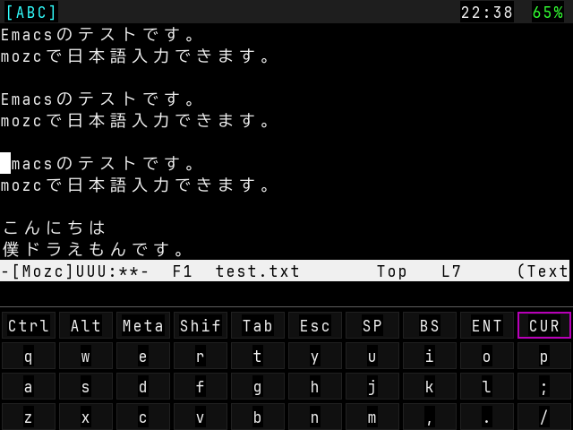
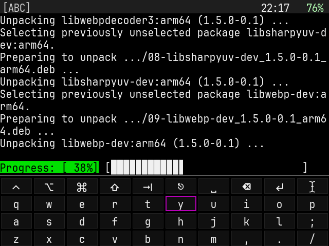

# GKDTerm


GKD Pixel 2 用 ROCKNIX ベース OS 向けの SDL2 + libvterm ターミナルソフトです。

<p align="center">
  
  
</p>

## 機能

- SDL2 によるレンダリング
- libvterm によるターミナルエミュレーション
- 3層ソフトウェアキーボード
- 最大5セッションのマルチセッション対応
- 日本語表示（2セル幅）
- テキスト選択・コピー＆ペースト

## ターゲット

ROCKNIX（aarch64）ベースの OS で動作する想定です。

### 動作確認

- Plum OS

※ 他のデバイスおよび ROCKNIX ベース OS でも動作する可能性があります。

## インストール方法

1. フォントファイル `PixelMplus12-Regular.ttf` を入手
2. 以下の3ファイルを `/storage/roms/ports` にコピー

   - GKDTerm バイナリ
   - `GKDTerm.sh`
   - `PixelMplus12-Regular.ttf`

3. EmulationStation に `PORTS` が表示され、
   その中に `GKDTerm` が追加されます。

## 使い方

本ソフトは以下の 4 モードで操作します。

- 通常モード
- カーソルモード
- リージョンモード
- 選択モード

加えて、セッション管理画面があります。

### 通常モード

基本操作モードです。

| ボタン | 動作 |
|--------|------|
| Dパッド | ソフトウェアキーボードのフォーカス移動 |
| A | 選択キー入力 |
| B | バックスペース |
| X | エンター |
| Y | スペース |
| L1 | キーボードレイヤー変更 |
| R1 | タブ |
| L2 | 画面上スクロール |
| R2 | 画面下スクロール |
| MENU | セッション管理画面 |
| START | ペースト |
| START + SELECT | 終了 |

### カーソルモード

ソフトウェアキーボードの `CUR` にフォーカスして  
A ボタンを押すと遷移します。

| ボタン | 動作 |
|--------|------|
| Dパッド | 矢印キーをシェルへ送信 |

### リージョンモード

カーソルモード中に X ボタンで遷移。

別カーソルが表示され、  
Dパッドでターミナル領域を自由に移動できます。

### 選択モード

リージョンモード中に X ボタンで遷移。

| ボタン | 動作 |
|--------|------|
| Dパッド | 選択範囲指定 |
| Y | 選択範囲コピー |

## ビルド方法

ROCKNIX ツールチェーンが必要です。

例として作業ディレクトリ `/ROCKNIX` で説明します。

### ツールチェーン取得

```bash
mkdir -p /ROCKNIX
git clone https://github.com/ROCKNIX/distribution.git
cd distribution
DEVICE=RG351MP PROJECT=ROCKNIX ARCH=aarch64 make docker-RK3326
```

※ glu, SDL2 で停止する場合があります。適宜対応してください。

### 本プロジェクト取得

```
cd /ROCKNIX/distribution
git clone https://github.com/SeijiIto/GKDTerm.git
cd GKDTerm
git submodule update --init
```

### Docker 環境へ入る

```
make docker-shell
```

### ビルド環境セットアップ

```
export TOOLCHAIN_BIN=/ROCKNIX/build.ROCKNIX-RK3326.aarch64/toolchain/bin
export SYSROOT=/ROCKNIX/build.ROCKNIX-RK3326.aarch64/toolchain/aarch64-rocknix-linux-gnu/sysroot
export CC=$TOOLCHAIN_BIN/aarch64-rocknix-linux-gnu-gcc
export CXX=$TOOLCHAIN_BIN/aarch64-rocknix-linux-gnu-g++
export CCACHE_DIR=/tmp/ccache
mkdir -p /tmp/ccache
```

### ビルド

```
make
```

### 実機へ転送（WiFi + SSH）

```
make push DEVICE=root@<IP of GKD Pixel 2>
```

## ライセンス
MIT ライセンスです。
これはホビープロジェクトです。
サポートはいたしません。
フォークは歓迎です。

---

# GKDTerm

SDL2 + libvterm based terminal for ROCKNIX handheld devices (GKD Pixel 2).

## Features

- SDL2 rendering
- libvterm backend
- 3-layer software keyboard
- Up to 5 sessions
- Japanese display support (2-cell width)
- Text selection and copy/paste

## Target

Designed for ROCKNIX (aarch64).

Tested on:
- Plum OS (GKD Pixel 2)

May work on other ROCKNIX-based devices.

## Installation

1. Obtain `PixelMplus12-Regular.ttf`
2. Copy the following files to:

   `/storage/roms/ports`

   - GKDTerm binary
   - `GKDTerm.sh`
   - `PixelMplus12-Regular.ttf`

3. Launch from `PORTS` in EmulationStation.

## Controls

GKDTerm has four modes:

- Normal
- Cursor
- Region
- Selection

Plus a session manager.

### Normal Mode

| Button | Action |
|--------|--------|
| D-Pad | Move keyboard focus |
| A | Input selected key |
| B | Backspace |
| X | Enter |
| Y | Space |
| L1 | Change keyboard layer |
| R1 | Tab |
| L2 | Scroll up |
| R2 | Scroll down |
| MENU | Session manager |
| START | Paste |
| START + SELECT | Exit |

### Cursor Mode

Focus `CUR` key and press A.

D-Pad inputs are sent as arrow keys to the shell.

### Region Mode

Press X in Cursor Mode.

Move freely inside terminal area.

### Selection Mode

Press X in Region Mode.

| Button | Action |
|--------|--------|
| D-Pad | Select text |
| Y | Copy selection |

## License

MIT License.

This is a hobby project.
No guaranteed support.
Feel free to fork.
