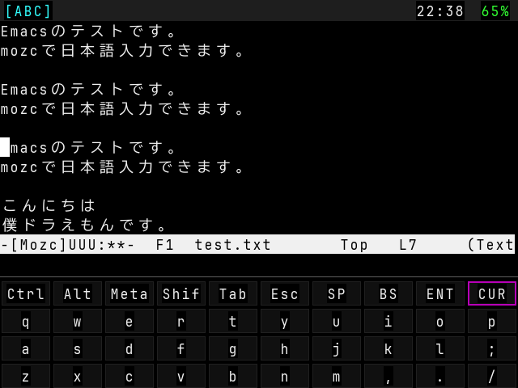
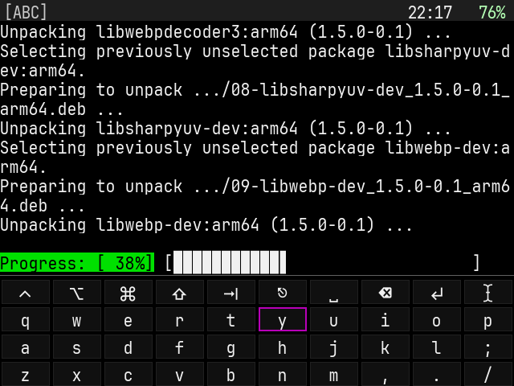
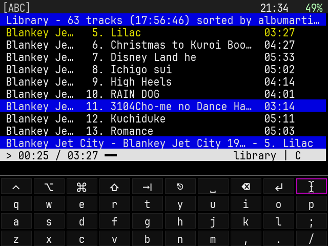
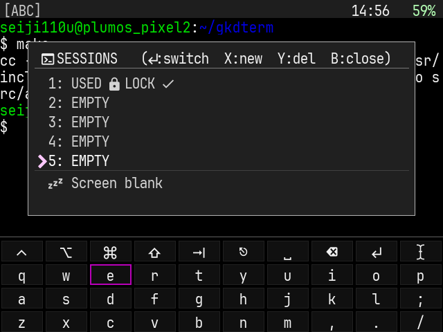
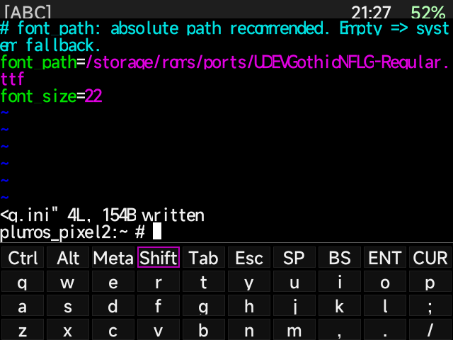

# GKDTerm


GKD Pixel2 用 ROCKNIX ベース OS 向けの SDL2 + libvterm ターミナルソフトです。

<p align="center">
  
  
</p>
<p align="center">
  
  
</p>

## 機能

- SDL2 によるレンダリング
- libvterm によるターミナルエミュレーション
- 3層ソフトウェアキーボード
- 最大5セッションのマルチセッション対応
- 日本語表示（2セル幅）
- テキスト選択・コピー＆ペースト
- フォント設定可能

## ターゲット

ROCKNIX（aarch64）ベースの OS で動作する想定です。

### 動作確認

- [plumOS](https://github.com/game-de-it/plumOS-pixel2)

※ 他のデバイスおよび ROCKNIX ベース OS でも動作する可能性があります。

## インストール方法

1. 以下の3ファイルを `/storage/roms/ports` にコピー

   - GKDTerm バイナリ
   - `GKDTerm.sh`

2. EmulationStation に `PORTS` が表示され、
   その中に `GKDTerm` が追加されます。

## 使い方

本ソフトは以下の 4 モードで操作します。

- 通常モード
- カーソルモード
- リージョンモード
- 選択モード

加えて、セッション管理画面があります。

### 通常モード

基本操作モードです。

| ボタン | 動作 |
|--------|------|
| Dパッド | ソフトウェアキーボードのフォーカス移動 |
| A | 選択キー入力 |
| B | バックスペース |
| X | エンター |
| Y | スペース |
| L1 | キーボードレイヤー変更 |
| R1 | タブ |
| L2 | 画面上スクロール |
| R2 | 画面下スクロール |
| MENU | セッション管理画面 |
| SELECT | `/storage/roms/screenshots` にスクリーンショットを撮影 |
| START | ペースト |
| START + SELECT | 終了 |

### カーソルモード

ソフトウェアキーボードの `CUR` にフォーカスして  
A ボタンを押すと遷移します。

| ボタン | 動作 |
|--------|------|
| Dパッド | 矢印キーをシェルへ送信 |

### リージョンモード

カーソルモード中に X ボタンで遷移。

別カーソルが表示され、  
Dパッドでターミナル領域を自由に移動できます。

### 選択モード

リージョンモード中に X ボタンで遷移。

| ボタン | 動作 |
|--------|------|
| Dパッド | 選択範囲指定 |
| Y | 選択範囲コピー |

### フォント

フォントは `/storage/.config/gkd_term/config.ini` に `font_path` を設定してください。

`font_size` は、まだ対応が不十分なので、`18〜24` くらいが実用的です。

Nerd Fontに対応しているフォントであれば、スクリーンショットのように制御キーなどがアイコンで表示されます。

スクリーンショットのフォントは、`UDEVGothicNFLG-Regular.ttf` を利用させていただいています。

- [Nerd Font](https://www.nerdfonts.com/)
- [UDEV Gothic](https://github.com/yuru7/udev-gothic)

フォントを指定しない場合は、以下のようにシステムフォントが利用されます。

<p align="center">
  
</p>


## 運用案

plumOS には chroot コマンドが含まれています。

また、GKD Pixel2 に直接インストールはできませんが、Debian ベースの dArkOS という OS があります。

PCで、以下のように plumOS がインストールされた microSD カードを用意することで、chroot 環境で dArkOS が利用できます。 

- microSD(A) カードに plumOS を焼く
- microSD(B) カードに dArkOS を焼く
- microSD(A) の ROMSパーティション を拡張しext4に再フォーマット
- microSD(B) の ROOTFSパーティション を rsync でバックアップ
- microSD(A) の ROMSパーティション に上記でバックアップしたルートファイルシステムを rsync で展開
- 一応、microSD(A) で GKD Pixel2 を起動する

microSD(A) で起動すると、ROMSパーティションに、dArkOS のルートファイルシステムに混ざって、`roms` ディレクトリが作成されていると思います。

`roms/ports` に GKDTerm をインストールし、以下のスクリプトを叩くことで dArkOS のルートファイルシステムを利用できます。

はじめに root ユーザーで dArkOS に入り、一般ユーザーを作るなどして利用します。

```sh:dArkOS.sh
#!/bin/bash

if [ $# -lt 1 ]; then
    echo "Usage: $0 <chroot-user>"
    exit 1
fi

CHROOT_USER="$1"
CHROOT_DIR="/storage/games-external"
CHROOT_UID=""
if grep "^${CHROOT_USER}:" /storage/games-external/etc/passwd > /dev/null; then
    CHROOT_UID=$(grep "^${CHROOT_USER}:" /storage/games-external/etc/passwd | cut -d: -f3)
else
    echo "No user on chroot."
    exit 1
fi

if ! mountpoint -q "${CHROOT_DIR}/proc"; then
    mount -t proc /proc "${CHROOT_DIR}/proc"
fi
if ! mountpoint -q "${CHROOT_DIR}/sys"; then
    mount -t sysfs /sys "${CHROOT_DIR}/sys"
fi
if ! mountpoint -q "${CHROOT_DIR}/run"; then
    mount --bind /run "${CHROOT_DIR}/run"
fi
if ! mountpoint -q "${CHROOT_DIR}/dev"; then
    mount --rbind /dev "${CHROOT_DIR}/dev"
fi
if ! mountpoint -q "${CHROOT_DIR}/run/user/${CHROOT_UID}"; then
    mkdir -p "${CHROOT_DIR}/run/user/${CHROOT_UID}"
    mount --bind "${XDG_RUNTIME_DIR}" "${CHROOT_DIR}/run/user/${CHROOT_UID}"
fi
if ! mountpoint -q "${CHROOT_DIR}/var/run/dbus"; then
    mkdir -p "${CHROOT_DIR}/var/run/dbus"
    mount --bind /var/run/dbus "${CHROOT_DIR}/var/run/dbus"
fi

cp /etc/resolv.conf "${CHROOT_DIR}/etc/resolv.conf"

chroot "${CHROOT_DIR}" /bin/bash -c "exec su - $CHROOT_USER"
```

- [dArkOS](https://github.com/christianhaitian/dArkOS)

### その他

スクリーンショットの日本語入力は dArkOS にインストールした Emacs + mozc.el という環境で、日本語入力を実現しています。

また、ターミナルで動作する音楽再生ソフトとして、plumOS には mpg123 が含まれています。

これはこれで気軽に使えるのですが、プレイリストの表示などがあまりよろしくないので、dArkOS にインストールした cmus を利用しています。

chroot 環境で音を鳴らすには、以下の条件を整える必要があります。

- ユーザーが audio グループに参加していること
- audio グループの GID がホスト（plumOS）のそれと一致すること

また、cmus は DBus を経由するので、`dbus-run-session cmus` というコマンドで、強制的にDBusセッションを新規作成して起動させるという、ちょっと力技が必要です。

## ビルド方法

ROCKNIX ツールチェーンが必要です。

例として作業ディレクトリ `/ROCKNIX` で説明します。

### ツールチェーン取得

```bash
mkdir -p /ROCKNIX
git clone https://github.com/ROCKNIX/distribution.git
cd distribution
DEVICE=RG351MP PROJECT=ROCKNIX ARCH=aarch64 make docker-RK3326
```

※ glu, SDL2 で停止する場合があります。適宜対応してください。

### 本プロジェクト取得

```
cd /ROCKNIX/distribution
git clone https://github.com/SeijiIto/GKDTerm.git
cd GKDTerm
git submodule update --init
```

### Docker 環境へ入る

```
make docker-shell
```

### ビルド環境セットアップ

```
export TOOLCHAIN_BIN=/ROCKNIX/build.ROCKNIX-RK3326.aarch64/toolchain/bin
export SYSROOT=/ROCKNIX/build.ROCKNIX-RK3326.aarch64/toolchain/aarch64-rocknix-linux-gnu/sysroot
export CC=$TOOLCHAIN_BIN/aarch64-rocknix-linux-gnu-gcc
export CXX=$TOOLCHAIN_BIN/aarch64-rocknix-linux-gnu-g++
export CCACHE_DIR=/tmp/ccache
mkdir -p /tmp/ccache
```

### ビルド

```
make
```

### 実機へ転送（WiFi + SSH）

```
make push DEVICE=root@<IP of GKD Pixel2>
```

## ライセンス
MIT ライセンスです。
これはホビープロジェクトです。
サポートはいたしません。
フォークは歓迎です。

---

# GKDTerm

SDL2 + libvterm based terminal for ROCKNIX handheld devices (GKD Pixel2).

## Features

- SDL2 rendering
- libvterm backend
- 3-layer software keyboard
- Up to 5 sessions
- Japanese display support (2-cell width)
- Text selection and copy/paste

## Target

Designed for ROCKNIX (aarch64).

Tested on:

- [plumOS](https://github.com/game-de-it/plumOS-pixel2)

May work on other ROCKNIX-based devices.

## Installation

1. Copy the following files to:

   `/storage/roms/ports`

   - GKDTerm binary
   - `GKDTerm.sh`

2. Launch from `PORTS` in EmulationStation.

## Controls

GKDTerm has four modes:

- Normal
- Cursor
- Region
- Selection

Plus a session manager.

### Normal Mode

| Button | Action |
|--------|--------|
| D-Pad | Move keyboard focus |
| A | Input selected key |
| B | Backspace |
| X | Enter |
| Y | Space |
| L1 | Change keyboard layer |
| R1 | Tab |
| L2 | Scroll up |
| R2 | Scroll down |
| MENU | Session manager |
| SELECT | Save screenshot to `/storage/roms/screenshots` |
| START | Paste |
| START + SELECT | Exit |

### Cursor Mode

Focus `CUR` key and press A.

D-Pad inputs are sent as arrow keys to the shell.

### Region Mode

Press X in Cursor Mode.

Move freely inside terminal area.

### Selection Mode

Press X in Region Mode.

| Button | Action |
|--------|--------|
| D-Pad | Select text |
| Y | Copy selection |

## License

MIT License.

This is a hobby project.
No guaranteed support.
Feel free to fork.
